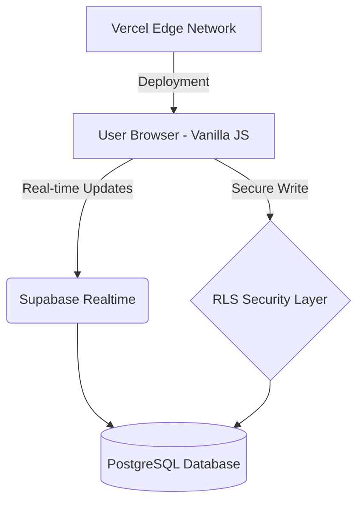

# ?? KeyGame: High-Performance Real-Time Learning Platform

[](https://keyboardgame-main.vercel.app)
[](https://supabase.com)
[](https://developer.mozilla.org/en-US/docs/Web/JavaScript)

[???? English Version](#-overview) | [???? Vers�o em Portugu�s](#-visao-geral)

---

## ???? Overview
**KeyGame** is a full-stack web application engineered to solve a specific educational bottleneck: the lack of digital fluency among students. Developed during my tenure as a scholarship instructor for the **PIBEX "Programe seu Futuro"** project, this tool uses gamification and real-time feedback to accelerate the learning curve of essential Windows/Linux shortcuts.

### ?? The Game in Action
[**Play KeyGame Here**](https://keyboardgame-main.vercel.app)


---

### ?? Engineering Decisions & Architecture

To meet the requirements of a low-resource classroom environment while maintaining professional engineering standards, I made the following choices:

* **Zero-Dependency Frontend:** Built with **Vanilla JavaScript**. This ensures an ultra-low **Time-to-Interactive (TTI)** and minimal bundle size, crucial for older school computers with limited hardware.
* **Real-time Synchronization:** Leveraged **Supabase (PostgreSQL + WebSockets)** to build a live global leaderboard. This created a high-engagement, competitive environment for students.
* **Security & Data Integrity:** Implemented **Row Level Security (RLS)** policies at the database level. This prevents client-side manipulation of scores, ensuring that only valid game sessions can write to the ranking.
* **Bilingual by Design:** Engineered a lightweight custom translation engine to support `en` and `pt-BR` natively.

### ?? Real-World Impact
I applied this project in a real classroom environment with **22 students**. The real-time ranking system created a healthy competitive environment, driving engagement and solving the lack of keyboard familiarity in a natural and exciting way.


---

## ???? Vis�o Geral
O **KeyGame** � uma aplica��o web full-stack projetada para resolver um gargalo educacional espec�fico: a falta de fluidez digital (atalhos de teclado) entre estudantes. Desenvolvido durante minha monitoria no projeto **PIBEX "Programe seu Futuro"**, a ferramenta utiliza gamifica��o e feedback em tempo real para acelerar o aprendizado de atalhos essenciais.

### ?? Decis�es de Engenharia
* **Frontend Zero-Dependency:** Constru�do com **Vanilla JavaScript** para garantir um **TTI (Time-to-Interactive)** baix�ssimo, essencial para computadores escolares antigos.
* **Sincroniza��o em Tempo Real:** Utiliza��o do **Supabase (PostgreSQL + WebSockets)** para um ranking global vivo.
* **Seguran�a e Integridade:** Implementa��o de pol�ticas de **Row Level Security (RLS)** no banco de dados para evitar trapa�as via console do navegador.

---

## ??? Technical Architecture / Arquitetura



## ?? Getting Started / Como Rodar

### Prerequisites / Pr�-requisitos
* A Supabase project (URL and Anon Key).
* Local server (e.g., Live Server extension or Node.js).

### Installation / Instala��o
```bash
# Clone the repository
git clone https://github.com/erikllasch/KeyGame.git

# Navigate to the project
cd KeyGame

# Setup Environment Variables
# Create a .env file or config.js with your Supabase credentials
```

## ?? About Me / Sobre Mim


I�m Erik Luan Lasch, a Software Engineering student passionate about building software solutions that tackle real problems directly, scalably, and without unnecessary complexity. I believe the best technology is the one that creates tangible impact on people�s lives.

I have hands-on experience in full-stack development, applying software engineering methods and processes to deliver efficient applications. I thrive in environments where I can observe a problem, focus on the user, and build a pragmatic solution.

## ?? Contact / Contato
* ?? LinkedIn
* ?? Email
