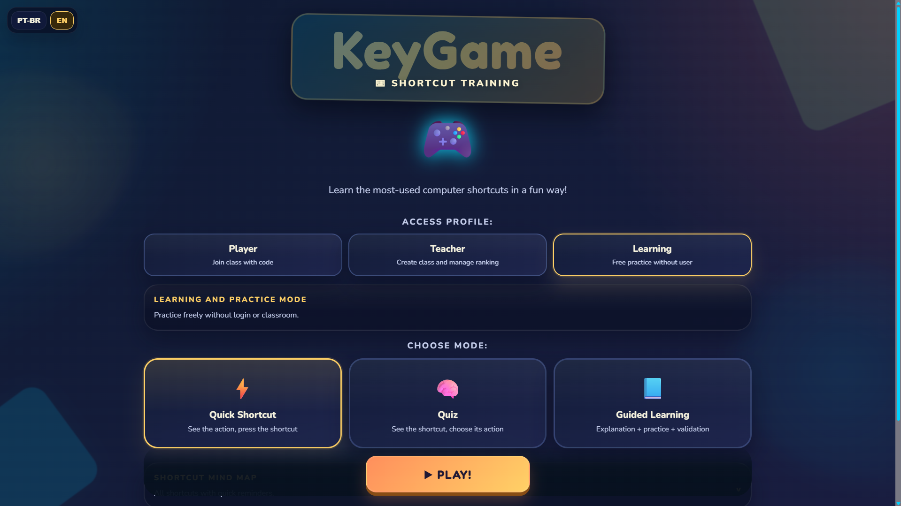
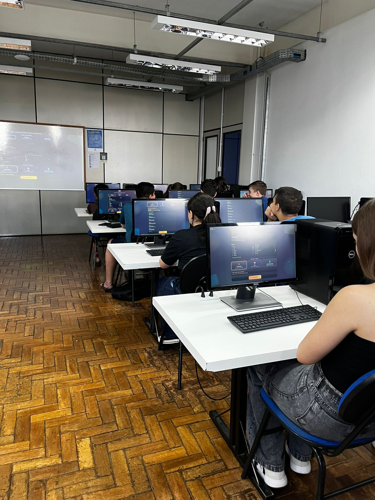
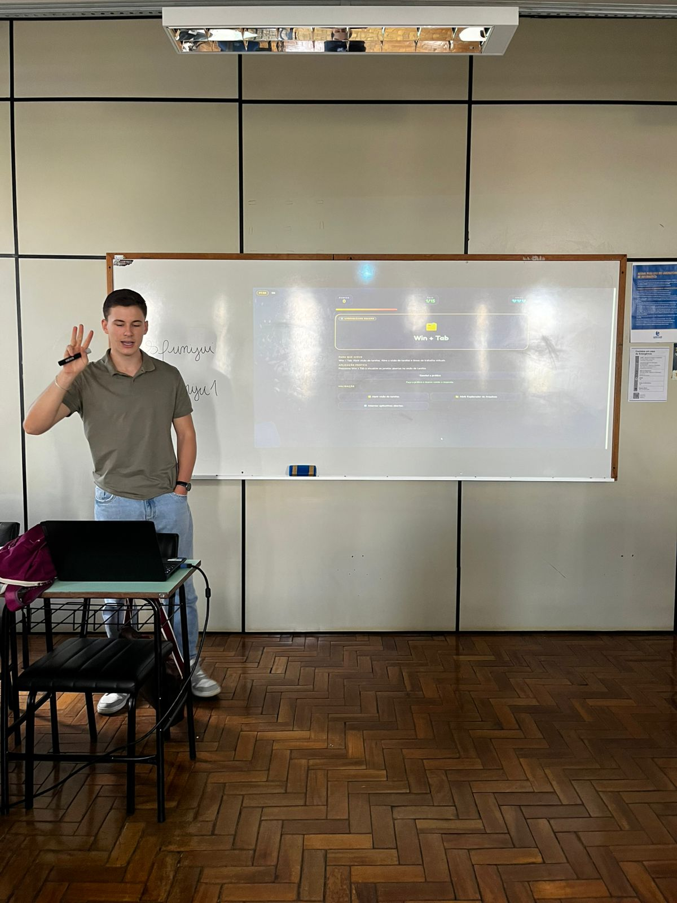

# ⌨️ KeyGame

### Welcome to my Full-Stack project!
This repository showcases my experience in software engineering and pragmatic problem-solving, highlighting a fast, real-time web application built from scratch to address a real-world educational gap.

### 🎮 The Game in Action
[Play KeyGame Here](https://keyboardgame-main.vercel.app)

### 🏫 Real-World Impact
I applied this project in a real classroom environment with 22 students. The real-time ranking system created a healthy competitive environment, driving engagement and solving the lack of keyboard familiarity in a natural and exciting way.

### ⚙️ Architecture & Tech Stack
The focus of this project was delivering value without unnecessary complexity:
* **Frontend:** Vanilla JavaScript, HTML, and CSS for instant loading on limited school computers.
* **Backend & DB:** Supabase (PostgreSQL) for real-time ranking and data persistence, leveraging Row Level Security (RLS).
* **Deployment:** Vercel.
* **Bilingual by Design:** Built-in support for `pt-BR` and `en` to provide practical English exposure to students.

### ⌨️ About KeyGame
During my work as an instructor on the extension project **"Programe seu Futuro"**, I identified a critical obstacle: students had gaps in basic digital literacy and didn’t know essential Windows shortcuts like `Ctrl+C` and `Ctrl+V`.

Knowing that the next phase of the course would use MIT App Inventor, this lack of fluency would significantly slow down their learning. Since I couldn't find a dynamic, interactive tool to teach this, I decided to build one. KeyGame's mission is to make digital fluency straightforward and enjoyable through gamification.

### 🙋 About Me

I’m Erik, a Software Engineering student passionate about building software solutions that tackle real problems directly, scalably, and without unnecessary complexity. I believe the best technology is the one that creates tangible impact on people’s lives.

I have hands-on experience in full-stack development, applying software engineering methods and processes to deliver efficient applications. I thrive in environments where I can observe a problem, focus on the user, and build a pragmatic solution.

### 📞 Contact me
If you liked this project, feel free to share 🚀

💠 My LinkedIn profile: https://www.linkedin.com/in/erikllasch/

💠 My email: erikllasch@gmail.com
