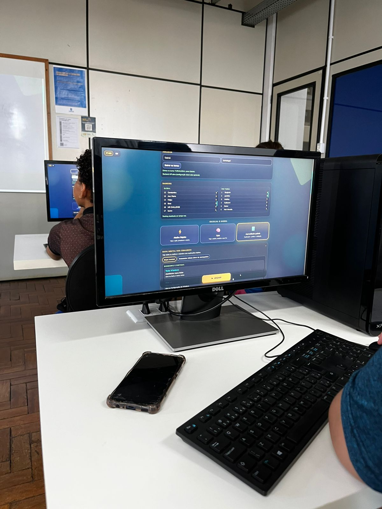

⌨️ KeyGame
Welcome to my Full-Stack project!
This repository showcases my experience in software engineering and pragmatic problem-solving, highlighting a fast, real-time web application built from scratch to address a real-world educational gap.

### Demo Screenshots

🎮 The Game in Action
Play KeyGame Here

🏫 Real-World Impact
I applied this project in a real classroom environment with 22 students. The real-time ranking system created a healthy competitive environment, driving engagement and solving the lack of keyboard familiarity in a natural and exciting way.

⚙️ Architecture & Tech Stack
The focus of this project was delivering value without unnecessary complexity:

Frontend: Vanilla JavaScript, HTML, and CSS for instant loading on limited school computers.

Backend & DB: Supabase (PostgreSQL) for real-time ranking and data persistence, leveraging Row Level Security (RLS).

Deployment: Vercel.

Bilingual by Design: Built-in support for pt-BR and en to provide practical English exposure to students.

⌨️ About KeyGame
During my work as an instructor on the extension project "Programe seu Futuro", I identified a critical obstacle: students had gaps in basic digital literacy and didn’t know essential Windows shortcuts like `Ctrl+C` and `Ctrl+V`.

Knowing that the next phase of the course would use MIT App Inventor, this lack of fluency would significantly slow down their learning. Since I couldn't find a dynamic, interactive tool to teach this, I decided to build one. KeyGame's mission is to make digital fluency straightforward and enjoyable through gamification.

🙋 About Me
I’m Erik, a Software Engineering student passionate about building software solutions that tackle real problems directly, scalably, and without unnecessary complexity. I believe the best technology is the one that creates tangible impact on people’s lives.

I have hands-on experience in full-stack development, applying software engineering methods and processes to deliver efficient applications. I thrive in environments where I can observe a problem, focus on the user, and build a pragmatic solution.

📞 Contact me
If you liked this project, feel free to share 🚀

💠 My LinkedIn profile: https://www.linkedin.com/in/erikllasch/

💠 My email: erikllasch@gmail.com

---

# ⌨️ KeyGame
Bem-vindo ao meu projeto Full-Stack!
Este repositório mostra minha experiência em engenharia de software e solução pragmática de problemas, destacando um aplicativo web rápido e em tempo real construído do zero para resolver uma lacuna educacional real.

### Capturas de Tela

🎮 O Jogo em Ação
Jogue KeyGame Aqui

🏫 Impacto no Mundo Real
Apliquei este projeto em um ambiente de sala de aula real com 22 alunos. O sistema de ranking em tempo real criou um ambiente de competição saudável, aumentando o engajamento e resolvendo a falta de familiaridade com o teclado de forma natural e empolgante.

⚙️ Arquitetura e Tech Stack
O foco deste projeto foi entregar valor sem complexidade desnecessária:

Frontend: Vanilla JavaScript, HTML e CSS para carregamento instantâneo em computadores escolares limitados.

Backend & BD: Supabase (PostgreSQL) para ranking em tempo real e persistência de dados, aproveitando o Row Level Security (RLS).

Deploy: Vercel.

Bilíngue por Design: Suporte integrado a pt-BR e en para fornecer exposição prática ao inglês aos alunos.

⌨️ Sobre o KeyGame
Durante meu trabalho como instrutor no projeto de extensão "Programe seu Futuro", identifiquei um obstáculo crítico: os alunos tinham lacunas em literacia digital básica e não sabiam atalhos essenciais do Windows como `Ctrl+C` e `Ctrl+V`.

Sabendo que a próxima fase do curso usaria MIT App Inventor, essa falta de fluência desaceleraria significativamente o aprendizado deles. Como eu não encontrei uma ferramenta dinâmica e interativa para ensinar isso, decidi construir uma. A missão do KeyGame é tornar a fluência digital direta e prazerosa por meio da gamificação.

🙋 Sobre Mim
Sou Erik, estudante de Engenharia de Software apaixonado por construir soluções de software que atacam problemas reais diretamente, de forma escalável e sem complexidade desnecessária. Acredito que a melhor tecnologia é aquela que gera impacto tangível na vida das pessoas.

Tenho experiência prática em desenvolvimento full-stack, aplicando métodos e processos de engenharia de software para entregar aplicações eficientes. Eu prospero em ambientes onde posso observar um problema, focar no usuário e construir uma solução pragmática.

📞 Contate-me
Se você gostou deste projeto, fique à vontade para compartilhar 🚀

💠 Meu perfil no LinkedIn: https://www.linkedin.com/in/erikllasch/

💠 Meu email: erikllasch@gmail.com
